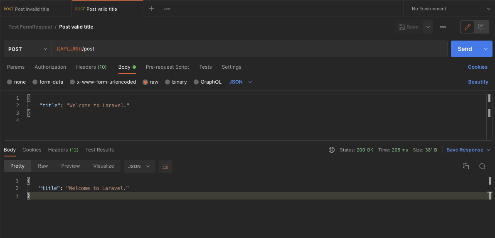
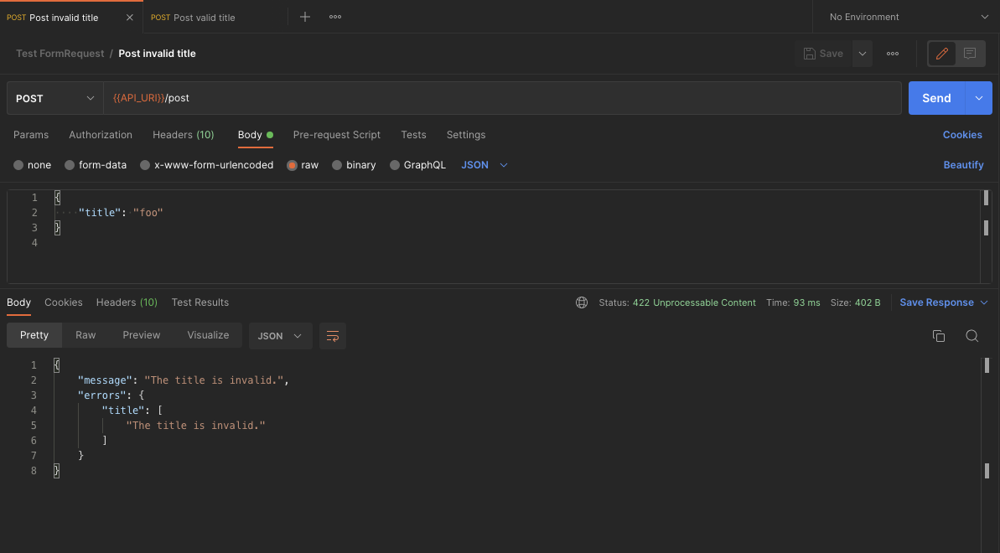

## Testing Form Requests

#### Usage

- Clone repository.
- Import `postman.json` collection.
- - Update `API_URL` in collection if not matching.
- Test requests from Postman collection.

### Valid Postman Request.

### Invalid Postman Request.

